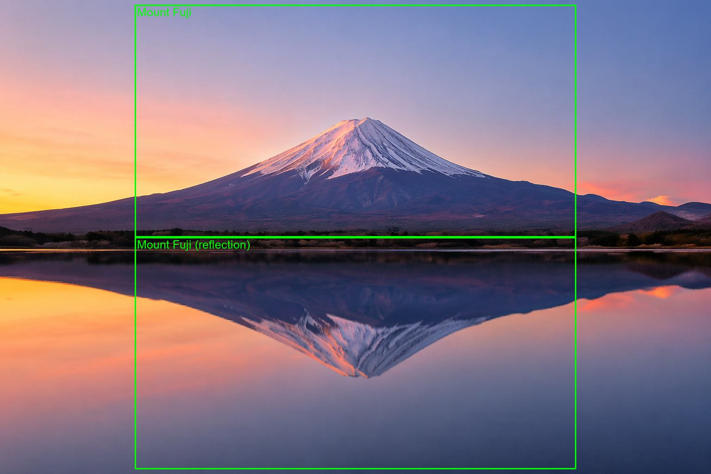

# Object Detection API with FastAPI × Gemini

A REST API that accepts an uploaded image and returns detected objects with bounding boxes, powered by Google Gemini 2.5 Flash.

> I wrote a technical article on Qiita explaining the implementation behind this repository (Japanese).
> **[FastAPIとLangChainで画像中の対象を検出するAPI作成](https://qiita.com/KuonIto/items/6a5ddd86e076ba9a40b1)**

## Demo

Calling the `/visualize` endpoint draws labeled bounding boxes over detected objects in the image.



---

## Tech Stack

| Category | Technology |
|---|---|
| Web Framework | FastAPI |
| AI Model | Google Gemini 2.5 Flash (multimodal) |
| LLM Pipeline | LangChain (LCEL) |
| Schema Validation | Pydantic v2 |
| Image Processing | Pillow |
| Runtime | Python 3.11+ / uvicorn |

---

## Endpoints

### `POST /detect`
Accepts an image and returns detection results as JSON.

**Request:** `multipart/form-data`
- `file`: image file (JPEG / PNG)
- `query`: target to detect (e.g. `"person"`, `"Mt. Fuji"`)

**Response:**
```json
{
  "description": "A landscape photo with Mt. Fuji in the background.",
  "detected_objects": [
    {
      "label": "Mt. Fuji",
      "box_2d": [120, 200, 800, 900]
    }
  ]
}
```

---

### `POST /visualize`
Accepts an image and returns a JPEG with bounding boxes and labels drawn on it.

**Request:** same as `/detect`

**Response:** `image/jpeg` (annotated image)

---

## Setup

```bash
# Install dependencies
pip install -e .

# Configure environment variables
cp .env.example .env
# Fill in GOOGLE_API_KEY in .env
```

```bash
# Start the server
uvicorn main:app --reload
```

Once running, open `http://localhost:8000/docs` to explore the API via Swagger UI.

---

## Design Highlights

- **Dependency Injection (`Depends`)**: File validation is extracted into `get_image_file`, keeping endpoint logic focused on business logic
- **Async I/O (`async/await`)**: File reads and LLM calls are handled asynchronously to avoid blocking the event loop
- **StreamingResponse**: Annotated images are returned directly from memory without writing to disk, reducing overhead
- **LangChain LCEL Pipeline**: Pre-processing → prompt → LLM → structured output are chained with the `|` operator for a clean, readable pipeline
- **Structured Output (Pydantic)**: `with_structured_output(DetectionResult)` automatically parses LLM responses into type-safe Python objects
- **APIRouter**: Routes are grouped by feature, making the codebase easy to extend

---

## Project Structure

```
.
├── main.py        # FastAPI app and endpoint definitions
├── chain.py       # LangChain pipeline (Gemini integration)
├── schema.py      # Pydantic schemas (DetectionResult)
└── pyproject.toml # Dependency definitions
```
